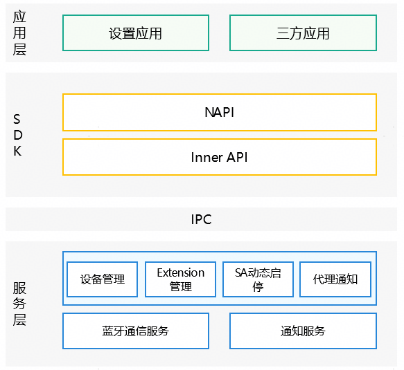

# Fusion connectivity 

## Introduction

This repository contains the source code for the Fusion Connectivity. The Fusion Connectivity provides applications with device discovery and device offline notification capabilities.

### Content Introduction

This module, based on Bluetooth communication technology, provides applications with device discovery and device offline notification capabilities. Its main features include:

- Dynamically monitors and discovers Bluetooth devices pre-registered by the application.
- Employs a process startup mechanism to automatically launch the application’s [PartnerAgentExtensionAbility]((https://gitcode.com/openharmony/docs/blob/master/zh-cn/application-dev/reference/apis-connectivity-kit/js-apis-fusionConnectivity-partnerAgentExtensionAbility.md)) process when target devices appear.
- Uses a process termination mechanism to automatically destroy the application’s [PartnerAgentExtensionAbility]((https://gitcode.com/openharmony/docs/blob/master/zh-cn/application-dev/reference/apis-connectivity-kit/js-apis-fusionConnectivity-partnerAgentExtensionAbility.md)) process when all devices go offline.
- Notifies the application of discovered registered devices via the [PartnerAgentExtensionAbility]((https://gitcode.com/openharmony/docs/blob/master/zh-cn/application-dev/reference/apis-connectivity-kit/js-apis-fusionConnectivity-partnerAgentExtensionAbility.md)) interface.

### Architectural Diagram



As shown in the diagram above, the Fusion Connectiviry mainly consists of four modules: Device Management, Extension Management, SA Dynamic Start/Stop, and Proxy Notification.

- The Device Management module primarily registers devices via interfaces. When a device is discovered by the Bluetooth service, it can notify the third-party application’s extension process, ensuring the application can perceive data activities from the corresponding device.
- The Extension Management module is mainly responsible for providing device discovery and offline notification capabilities, which applications need to inherit and implement. The type attribute in the extensionabilities section of the application’s module-level configuration file (module.json5) should be configured as partnerAgent.
- The SA Dynamic Start/Stop module provides dynamic starting and stopping of this service to prevent resource wastage.
- The Proxy Notification module primarily provides the capability to send notifications. The lifecycle of these notifications is consistent with the extension, intended to inform users about extension activities within the system. All configuration items support user-level binding and persistent storage.
- For detailed information about the Fusion Short-Range Service and other related modules, please refer to the [Fusion Connectivity Overview](https://gitcode.com/openharmony/docs/blob/master/zh-cn/application-dev/reference/apis-connectivity-kit/js-apis-fusionConnectivity-partnerAgent.md).

## Directory Structure

```
/foundation/communication
├── fusion_connectivity
│   ├── frameworks 
│   │   ├── ets                                          # Implementation of static interfaces
│   │   ├── extension                                    # JS interface implementation for extension startup
│   │   ├── inner                                        # Fusion Connectivity inner interfaces
│   │   └── napi                                         # Fusion Connectivity napi interfaces
│   ├── idl                                              # Interface IDL implementation
│   ├── interfaces                                       # Fusion Connectivity interface definitions
│   │   ├── extension                                    # Extension interface definitions
│   │   └── inner_api                                    # Fusion Connectivity inner_api interface definitions
│   ├── sa_profile                                       # SA definitions
│   ├── services                                         # Fusion Connectiviry services
│   │   ├── common                                       # Common code
│   │   ├── etc                                          # Configuration files for component processes
│   │   └── server                                       # Fusion Connectiviry server
│   ├── test                                             # Test directory
│   │   ├── fuzztest                                     # Fuzz testing
│   │   └── unitest                                      # Unit tests for interfaces
```

## Constraints and Restrictions

- Support [phone/2in1/tablet](https://gitcode.com/openharmony/docs/blob/master/zh-cn/application-dev/quick-start/module-configuration-file.md#devicetypes标签) product。


## Build Steps

- Full Build

    After modifying the build.gn file, execute:
    ```
    $ ./build.sh --product-name rk3568 --ccache
    ```
    If the build.gn file is unmodified, execute:
    ```
    $ ./build.sh --product-name rk3568 --ccache --fast-rebuild
    ```

- Partial Build

    ```
    $ ./build.sh --product-name rk3568 --ccache --build-target fusion_connectivity
    ```


## Instructions

### Interface Description

The Fusion Connectivity provides interfaces from three modules for developers: [partnerAgent](https://gitcode.com/openharmony/docs/blob/master/zh-cn/application-dev/reference/apis-connectivity-kit/js-apis-fusionConnectivity-partnerAgent.md), [PartnerAgentExtensionAbility]((https://gitcode.com/openharmony/docs/blob/master/zh-cn/application-dev/reference/apis-connectivity-kit/js-apis-fusionConnectivity-partnerAgentExtensionAbility.md)), and [PartnerAgentExtensionContext]((https://gitcode.com/openharmony/docs/blob/master/zh-cn/application-dev/reference/apis-connectivity-kit/js-apis-fusionConnectivity-partnerAgentExtensionContext.md)). the PartnerAgentExtensionAbility module is responsible for managing the lifecycle of the ExtensionAbility component for device status notifications; the PartnerAgentExtensionContext module is responsible for managing the context of the device status notification capability; the partnerAgent module is used for managing devices registered by the application.

| 名称 | 描述 |
| ---- | ---- |
| bindDevice(deviceAddress: PartnerDeviceAddress, deviceCapability: DeviceCapability, businessCapability: BusinessCapability, partnerAgentExtensionAbilityName: string): Promise\<void\> | Application registers a device. |
| unbindDevice(deviceAddress: PartnerDeviceAddress): Promise\<void\> |  Application unregisters a device. |
| onDestroyWithReason(resaon: PartnerAgentExtensionAbilityDestroyReason): Promise\<void\> | Callback method triggered when the Partner Agent Extension Ability is destroyed. |
| onDeviceDiscovered(deviceAddress: PartnerDeviceAddress): Promise\<void\> | When a registered device is discovered, the system calls this callback method. |

### Usage Instructions

For specific usage methods, please refer to [Implementing an Extension Capability for Managing the Extension Lifecycle](https://gitcode.com/openharmony/docs/blob/master/zh-cn/application-dev/reference/apis-connectivity-kit/js-apis-fusionConnectivity-partnerAgentExtensionAbility.md).


## Related Repositories

[Fusion Connectiviry](https://gitcode.com/openharmony-sig/communication_fusion_connectivity)
