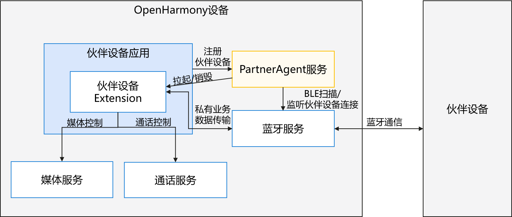

# 融合短距服务

## 简介

融合短距通信服务（以下简称融合短距）是 OpenHarmony 系统中统一管理短距离通信技术的服务，当前其内部实现了PartnerAgent服务模块，未来融合短距服务会扩展其他功能。




* 伙伴设备：生态设备厂商实现的蓝牙设备（例如手表、手环、耳机、码表等）。
* 伙伴设备应用：生态设备厂商实现控制伙伴设备的应用。
* 伙伴设备Extension：
    * 生态设备厂商实现的[**PartnerAgentExtensionAbility**](#系统框架)能力。
    * 伙伴设备Extension会和伙伴设备之间建立蓝牙连接，并进行私有业务数据传输。
    * 伙伴设备Extension收到伙伴设备的请求命令后，可以进行媒体控制（上一首、下一首、播放和暂停）和通话控制（通话挂断和接听）。
* PartnerAgent服务：
    * PartnerAgent服务提供了接口供伙伴设备应用注册伙伴设备。
    * PartnerAgent服务感知伙伴设备被注册后，触发蓝牙BLE扫描功能，并且监听伙伴设备的连接状态。
    * PartnerAgent服务通过BLE扫描到伙伴设备，或监听到伙伴设备已连接后，会拉起伙伴设备Extension。
    * PartnerAgent服务监听到伙伴设备断开连接后，会延迟3分钟销毁伙伴设备Extension。
* 媒体服务：OpenHarmony 基础系统服务，给伙伴设备Extension提供媒体控制能力。
* 通话服务：OpenHarmony 基础系统服务，给伙伴设备Extension提供通话控制能力。
* 蓝牙服务：OpenHarmony 基础系统服务，给伙伴设备Extension和PartnerAgent服务提供蓝牙扫描、蓝牙连接和蓝牙数据传输的能力。

### 系统框架


#### 模块功能说明

整体架构划分为应用层、框架层（提供API）、系统服务层。

* **应用层**
  * **系统设置**：系统设置应用，负责调用 `partnerAgent-sys` 系统接口，用于开启或关闭某个伙伴设备的能力。该能力被关闭后，partnerAgent服务后续不会再拉起伙伴设备Extension。
  * **伙伴设备应用**：终端用户应用，由生态设备厂商实现，负责调用 `partnerAgent` 的 `bindDevice()` 接口注册伙伴设备。
  * **伙伴设备Extension**：伙伴设备应用实现的 `PartnerAgentExtensionAbility` 能力。该Extension可以和伙伴设备建立蓝牙连接、进行蓝牙数据传输。伙伴设备Extension收到伙伴设备的命令后，可以进行媒体控制和通话控制。

- **框架层**
  * **partnerAgent-sys**：负责给系统设置提供 `enableDeviceControl/disableDeviceControl` 接口，用于开启或关闭某个伙伴设备的能力。该能力被关闭后，partnerAgent服务后续不会再拉起伙伴设备Extension。
  * **partnerAgent**：负责对伙伴设备应用提供 `bindDevice/unbindDevice/getBoundDevices` 等接口，处理伙伴设备的注册绑定和解注册功能。
  * **PartnerAgentExtensionAbility**：负责对伙伴设备Extension提供 `onDeviceDiscovered` 等接口，用于通知伙伴设备Extension已经发现了对应的伙伴设备。
  * **PartnerAgentExtensionContext**：负责提供伙伴设备Extension被拉起的上下文信息。

- **系统服务层**
  * **伙伴设备注册管理**：管理注册的伙伴设备信息。
    * 伙伴设备应用可调用 `bindDevice` 注册伙伴设备，调用 `unbindDevice` 解注册伙伴设备。
    * PartnerAgent服务感知到伙伴设备注册后，才会调用蓝牙服务接口进行BLE扫描和监听蓝牙连接状态去发现伙伴设备。
    * 下述场景PartnerAgent服务会自动解注册设备：1）伙伴设备应用注册的伙伴设备蓝牙配对关系丢失超过30天，2）和已注册伙伴设备关联的伙伴设备应用被卸载。
  * **PartnerAgentExtensionAbility管理**：负责控制伙伴设备Extension，当伙伴设备应用注册的伙伴设备被蓝牙BLE扫描/蓝牙连接发现后，拉起伙伴设备Extension进程，并通过 `onDeviceDiscovered` 接口通知伙伴设备Extension。
  * **PartnerAgent服务生命周期管理**：该模块提供PartnerAgent服务进程的动态启停功能，防止资源浪费。
  * **代理通知**：该模块负责管理负一屏的通知提醒，主要用于提醒用户，伙伴设备Extension进程正在后台运行，会增加一定的功耗耗电，并且可能会控制OpenHarmony设备的媒体能力和通话能力。
  
  * **蓝牙服务/AbilityManager服务/SAMgr管理/通知服务**：OpenHarmony 基础系统服务。蓝牙服务负责蓝牙扫描、蓝牙连接和蓝牙数据传输；AbilityManager服务提供拉起/销毁伙伴设备Extension的能力；SAMgr管理负责拉起/销毁PartnerAgent服务；通知服务负责在负一屏显示通知。

#### 关键交互说明

为了更清晰地展示各模块如何协同工作，以下详解四大核心流程：

##### 伙伴设备注册管理

1. 伙伴设备应用需要先触发和伙伴设备的[蓝牙配对](https://gitcode.com/openharmony/docs/blob/master/zh-cn/application-dev/connectivity/bluetooth/br-pair-device-development-guide.md)操作，再调用 `bindDevice` 接口注册伙伴设备。
2. PartnerAgent服务感知到伙伴设备注册后，才会调用蓝牙服务接口进行BLE扫描和监听蓝牙连接状态去发现伙伴设备，进而拉起伙伴设备Extension。若伙伴设备未注册，PartnerAgent服务不会拉起伙伴设备Extension。
3. 该注册信息会持久化存储，OpenHarmony设备重启后依旧生效。
4. 伙伴设备应用不需要使用该设备后，可调用 `unbindDevice` 接口解注册设备。

注意，为了避免资源泄漏，下述场景PartnerAgent服务会自动解注册伙伴设备：

1. 伙伴设备应用注册的伙伴设备蓝牙配对关系丢失超过30天。
2. 卸载伙伴设备应用。

##### PartnerAgentExtensionAbility管理

1. 伙伴设备应用注册伙伴设备后，本模块会触发蓝牙的BLE扫描和蓝牙连接监听，当OpenHarmony设备BLE扫描到该设备或连上已注册的伙伴设备时，本模块会拉起伙伴设备Extension进程。
2. OpenHarmony设备和已注册伙伴设备断开蓝牙连接后，本模块会延迟3分钟销毁伙伴设备Extension进程。若在3分钟内伙伴设备Extension重新和伙伴设备建立蓝牙连接，伙伴设备Extension进程不会被销毁。
3. 若多个伙伴设备应用注册同一个的伙伴设备，OpenHarmony设备连接该伙伴设备后，本模块会拉起该伙伴设备对应的所有伙伴设备Extension进程。OpenHarmony设备和该伙伴设备断连后，本模块会销毁该伙伴设备对应的所有伙伴设备Extension进程。

##### PartnerAgent服务生命周期管理

PartnerAgent服务采用“按需启动、动态退出”的策略，以降低系统资源消耗。

1. 拉起PartnerAgent服务：
    * 伙伴设备应用调用PartnerAgent服务接口时，会通过SAMgr拉起PartnerAgent服务进程，接口调用完成后，SAMgr会延迟30s自动卸载PartnerAgent服务进程。
    * 伙伴设备应用调用 `bindDevice` 接口注册伙伴设备后，会通过SAMgr拉起PartnerAgent服务进程，然后PartnerAgent服务会将`"persist.fusion_connectivity.enable_partner_agent"`系统参数置1，PartnerAgent服务即可在后台一直存在。
    * 系统设置应用调用 `enableDeviceControl` 接口开启已注册设备功能时，会通过SAMgr拉起PartnerAgent服务进程，然后PartnerAgent服务会将`"persist.fusion_connectivity.enable_partner_agent"`系统参数置1，PartnerAgent服务即可在后台一直存在。
 	 
2. 销毁PartnerAgent服务：
    * 伙伴设备应用调用 `unbindDevice` 接口解注册设备，且整个PartnerAgent服务内部无其他**启用的注册设备**，PartnerAgent服务会将`"persist.fusion_connectivity.enable_partner_agent"`系统参数置0，SAMgr延迟30s后会卸载PartnerAgent服务进程。
    * 系统设置应用调用 `disableDeviceControl` 接口关闭已注册设备功能，且整个PartnerAgent服务内部无其他**启用的注册设备**，PartnerAgent服务会将`"persist.fusion_connectivity.enable_partner_agent"`系统参数置0，SAMgr延迟30s后会卸载PartnerAgent服务进程。

**说明：**

PartnerAgent服务生命周期管理的配置可参考 `sa_profile/8630.json` 文件：

```json
{
    "process": "partner_device_agent",
    "systemability": [
        {
            ......
            "start-on-demand": {
                "allow-update":false,
                "commonevent":[
                    {
                        "name":"usual.event.bluetooth.host.STATE_UPDATE",
                        "value":"1",
                        "conditions": [
                            {
                                "name":"persist.fusion_connectivity.enable_partner_agent",
                                "value":"1"
                            }
                        ]
                    }
                ]
            },
            "stop-on-demand": {
                "param":[
                    {
                        "name":"persist.fusion_connectivity.enable_partner_agent",
                        "value":"0"
                    }
                ]
            }
        }
    ]
}
```

- 系统参数`"persist.fusion_connectivity.enable_partner_agent"`置为1后，SAMgr不会卸载PartnerAgent服务进程。即使OpenHarmony设备重启后，SAMgr也会自动拉起PartnerAgent服务进程。
- 系统参数`"persist.fusion_connectivity.enable_partner_agent"`置为0后，SAMgr会延迟30s卸载PartnerAgent服务进程。后续OpenHarmony设备重启后，SAMgr不会拉起PartnerAgent服务进程。
- 启用的注册设备 是指未被系统设置用 `disableDeviceControl` 接口关闭功能的已注册伙伴设备。

##### 代理通知

该模块负责管理负一屏的通知提醒，主要用于提醒用户，伙伴设备Extension进程正在后台运行，会增加一定的功耗耗电，并且可能会控制OpenHarmony设备的媒体能力和通话能力。

根据伙伴设备应用调用 `bindDevice()` 接口里 [BusinessCapability](https://gitcode.com/openharmony/docs/blob/master/zh-cn/application-dev/reference/apis-connectivity-kit/js-apis-fusionConnectivity-partnerAgent.md#partneragentbusinesscapability) 参数的不同组合，会有下述三种通知提醒：

  * `(supportMediaControl: true, supportTelephonyControl: false)`: 可进行媒体控制，获取相应信息，应用后台运行将增加耗电。
  * `(supportMediaControl: false, supportTelephonyControl: true)`: 可进行通话控制，获取相应信息，应用后台运行将增加耗电。
  * `(supportMediaControl: true, supportTelephonyControl: true)`: 可进行媒体、通话控制，获取相应信息，应用后台运行将增加耗电。

> 注意：PartnerAgent服务不支持 `(supportMediaControl: false, supportTelephonyControl: false)` 参数组合。

## 目录

```
/foundation/communication
├── fusion_connectivity
│   ├── frameworks                                       # 公共代码
│   │   ├── ets                                          # 静态接口的代码实现
│   │   ├── extension                                    # extension拉起的JS接口实现
│   │   ├── inner                                        # 融合短距服务inner接口
│   │   └── napi                                         # 融合短距服务napi接口
│   ├── idl                                              # 接口idl实现
│   ├── interfaces                                       # 接口
│   │   ├── extension                                    # extension接口定义
│   │   └── inner_api                                    # 内部接口
│   ├── sa_profile                                       # 系统服务配置文件
│   ├── services                                         # 融合短距服务层实现
│   │   ├── common                                       # 融合短距服务公共实现
│   │   ├── etc                                          # 融合短距服务配置目录
│   │   └── server                                       # 融合短距服务
│   ├── test                                             # 接口测试目录
│   │   ├── fuzztest                                     # fuzz测试
│   │   └── unitest                                      # 接口的单元测试
```

## 约束

- 支持[手机、PC、平板](https://gitcode.com/openharmony/docs/blob/master/zh-cn/application-dev/quick-start/module-configuration-file.md#devicetypes标签)产品。


## 编译构建

根据不同的目标平台，使用以下命令进行编译：

- 全量编译

    修改build.gn文件后编译命令
    ```
    $ ./build.sh --product-name {product_name} --ccache
    ```
    未修改build.gn文件编译命令
    ```
    $ ./build.sh --product-name {product_name} --ccache --fast-rebuild
    ```

- 单独编译

    ```
    $ ./build.sh --product-name {product_name} --ccache --build-target fusion_connectivity
    ```

> **说明：**
> {product_name} 为当前支持的平台名称，例如 rk3568。

## 使用说明

开发者可以使用下述方法判断系统内部是否支持PartnerAgent服务：

1. 开发者调用 `canIUse(SystemCapability.Communication.FusionConnectivity.Core)` 判断OpenHarmony设备是否支持该SysCap。
2. 若支持上述SysCap，开发者可调用 [partnerAgent.isPartnerAgentSupported](https://gitcode.com/openharmony/docs/blob/master/zh-cn/application-dev/reference/apis-connectivity-kit/js-apis-fusionConnectivity-partnerAgent.md#partneragentispartneragentsupported) 接口判断PartnerAgent服务功能是否支持。

### 接口说明

PartnerAgent服务服务提供了[partnerAgent](https://gitcode.com/openharmony/docs/blob/master/zh-cn/application-dev/reference/apis-connectivity-kit/js-apis-fusionConnectivity-partnerAgent.md)、[PartnerAgentExtensionAbility](https://gitcode.com/openharmony/docs/blob/master/zh-cn/application-dev/reference/apis-connectivity-kit/js-apis-fusionConnectivity-partnerAgentExtensionAbility.md)、[PartnerAgentExtensionContext](https://gitcode.com/openharmony/docs/blob/master/zh-cn/application-dev/reference/apis-connectivity-kit/js-apis-fusionConnectivity-partnerAgentExtensionContext.md)三个模块的接口供开发者使用。其中，PartnerAgentExtensionAbility模块负责设备状态通知的ExtensionAbility组件的生命周期管理；PartnerAgentExtensionContext模块负责设备状态通知能力的上下文管理；partnerAgent模块用于管理应用注册的设备。

fusion_connectivity部件向开发者提供了 **JS API**，为应用提供设备发现与设备下线的通知功能。主要接口及其功能如下：

**表 1** 接口说明

| 接口名称                      | 功能描述                                                             |
| ----------------------------- | -------------------------------------------------------------------- |
| **isPartnerAgentSupported**       | 判断本机设备是否支持PartnerAgent服务功能。 |
| **bindDevice**      | 应用注册设备。                                   |
| **unbindDevice**     | 应用解注册设备。                                   |
| **isDeviceBound**     | 判断当前应用是否已注册过该设备。                               |
| **getBoundDevices**       | 获取应用当前注册过的所有设备。                                             |
| **isDeviceControlEnabled**       | 判断当前设备的互通功能是否已经打开。                                             |
| **enableDeviceControl**     | 开启伙伴设备功能。                           |
| **disableDeviceControl**               | 关闭伙伴设备功能。                                         |
| **onDestroyWithReason**          | 伙伴设备Extension被销毁时触发的方法回调。                           |
| **onDeviceDiscovered**    | 当已注册的设备被发现时，系统会调用此回调方法。                                         |

### 开发步骤

开发者在实现一个伙伴设备Extension管理应用时，需要在DevEco Studio工程中新建一个PartnerAgentExtensionAbility，具体步骤如下：
以下演示使用JS API 实现一个外设生命周期管理应用的完整流程。

1. **实现PartnerAgentExtensionAbility**：伙伴设备Extension扩展能力的基础类，提供设备发现与设备下线的通知功能，需要应用继承实现。
2. **注册设备**：注册伙伴设备，注册设备的生命周期可以被PartnerAgentExtensionAbility感知。
3. **查询设备注册状态**：判断当前应用是否已注册过该设备。
4. **去注册设备**：调用本接口进行解注册后，应用的PartnerAgentExtensionAbility进程将不再接收此设备的发现和下线状态通知。

### 文件目录层级

1. 在工程Module对应的ets目录下，右键选择“New > Directory”，新建一个目录，并命名为entryability。

2. 在entryability目录下，右键选择“New > File”，新建两个文件，分别为EntryAbility.ets、PartnerAgentAbility.ets。目录如下：

   ``` TypeScript
   /src/main/
   ├── ets/entryability
   │       └──EntryAbility.ets               # 显示按钮交互界面
   │       └──PartnerAgentAbility.ets        # 自定义类继承PartnerAgentExtensionAbility并加上需要的生命周期回调
   │   ├───pages
   │       └── Index.ets                     # 绘制按钮交互页面，注册/去注册设备功能
   ├── resources/base/profile/main_pages.json  
   ```

#### 完整示例

1. PartnerAgentAbility.ets文件。

   在PartnerAgentAbility.ets文件中，增加导入PartnerAgentExtensionAbility的依赖包，自定义类继承PartnerAgentExtensionAbility并加上需要的生命周期回调。
   
``` TypeScript
import { partnerAgent } from '@kit.ConnectivityKit';
import { PartnerAgentExtensionAbility } from '@kit.ConnectivityKit';

export default class PartnerAgentAbility extends PartnerAgentExtensionAbility {
    onDeviceDiscovered(deviceAddress: partnerAgent.PartnerDeviceAddress): void {
    console.info(`[testTag] onDeviceDiscovered success: ${deviceAddress.bluetoothAddress?.address} ${deviceAddress.bluetoothAddress?.addressType}`);
    }

    onDestroyWithReason(reason: partnerAgent.PartnerAgentExtensionAbilityDestroyReason): void {
    console.info(`[testTag] onDestroyWithReason is: ${reason}`);
    }
}
```

2. EntryAbility.ets文件。

    EntryAbility中加载ets/pages/Index.dts绘制的页面，请求用户授予访问蓝牙权限。

  ``` TypeScript
  import { AbilityConstant, ConfigurationConstant, UIAbility, Want } from '@kit.AbilityKit';
  import { hilog } from '@kit.PerformanceAnalysisKit';
  import { window } from '@kit.ArkUI';

  const DOMAIN = 0x0000;

  export default class EntryAbility extends UIAbility {
    onCreate(want: Want, launchParam: AbilityConstant.LaunchParam): void {
      try {                                                        
        this.context.getApplicationContext().setColorMode(ConfigurationConstant.ColorMode.COLOR_MODE_NOT_SET);
      } catch (err) {
        hilog.error(DOMAIN, 'testTag', 'Failed to set colorMode. Cause: %{public}s', JSON.stringify(err));
      }
      hilog.info(DOMAIN, 'testTag', '%{public}s', 'Ability onCreate');
    }

    onDestroy(): void {
      hilog.info(DOMAIN, 'testTag', '%{public}s', 'Ability onDestroy');
    }

    onWindowStageCreate(windowStage: window.WindowStage): void {
      // Main window is created, set main page for this ability
      hilog.info(DOMAIN, 'testTag', '%{public}s', 'Ability onWindowStageCreate');

      windowStage.loadContent('pages/Index', (err) => {
        if (err.code) {
          hilog.error(DOMAIN, 'testTag', 'Failed to load the content. Cause: %{public}s', JSON.stringify(err));
          return;
        }
        hilog.info(DOMAIN, 'testTag', 'Succeeded in loading the content.');
      });
    }

    onWindowStageDestroy(): void {
      // Main window is destroyed, release UI related resources
      hilog.info(DOMAIN, 'testTag', '%{public}s', 'Ability onWindowStageDestroy');
    }

    onForeground(): void {
      // Ability has brought to foreground
      hilog.info(DOMAIN, 'testTag', '%{public}s', 'Ability onForeground');
    }

    onBackground(): void {
      // Ability has back to background
      hilog.info(DOMAIN, 'testTag', '%{public}s', 'Ability onBackground');
    }
  }
  ```

3. Index.ets文件。

    调用注册设备等功能接口。Index.ets中输入要注册的设备蓝牙地址，注册输入的蓝牙设备，去注册输入的蓝牙设备、查询设备的绑定状态，获取本机绑定的设备列表等
    [PartnerAgent服务接口调用](../reference/apis-connectivity-kit/js-apis-fusionConnectivity-partnerAgent.md)
    操作。


  ``` TypeScript
  import { BusinessError } from '@kit.BasicServicesKit';
  import common from '@ohos.bluetooth.common';
  import partnerAgent from '@ohos.FusionConnectivity.partnerAgent';

  @Entry
  @Component
  struct Index {
    @State perBtAddress: string = '';

    build() {
      Column() {
        Text("@ohos.BtDataWithExtension")
          .fontSize(20)
          .margin({ bottom: 16 })
          .fontWeight(FontWeight.Bold)
        TextInput({ placeholder: '请输入要绑定的设备地址', text: this.perBtAddress })
          .margin(1)
          .width('90%')
          .height(50)
          .type(InputType.Normal)
          .onChange((value: string) => {
            this.perBtAddress = value;
          })
        Row() {
          Button("bindDevice").fontSize(10).height(60).onClick(() => {
            console.info("[testTag] bindDevice");
            try {
              let btAddr: common.BluetoothAddress = {
                "address": this.perBtAddress,
                "addressType": common.BluetoothAddressType.REAL,
              };
              let deviceAddress: partnerAgent.PartnerDeviceAddress = {
                "bluetoothAddress": btAddr,
              };
              let capability: partnerAgent.DeviceCapability = {
                "supportBR": true,
                "supportBleAdvertiser": true,
              };
              let businessCap: partnerAgent.BusinessCapability = {
                "supportMediaControl": true,
                "supportTelephonyControl": false,
              };
              partnerAgent.bindDevice(deviceAddress, capability, businessCap, "PartnerAgentAbility")
                .then(() => {
                  console.info(`[testTag] bind device success:  ${btAddr.address}`);
                })
                .catch((err: BusinessError) => {
                  console.error(`errCode: ${err.code}, errMessage: ${err.message}`);
                });
            } catch (err) {
              console.error("[testTag] errCode:" + err.code + ",errMessage:" + err.message);
            }
          })
          Button("unbindDevice").fontSize(10).height(60).onClick(() => {
            console.info("[testTag] ubindDevice");
            try {
              let btAddr: common.BluetoothAddress = {
                "address": this.perBtAddress,
                "addressType": common.BluetoothAddressType.REAL,
              };
              let deviceAddress: partnerAgent.PartnerDeviceAddress = {
                "bluetoothAddress": btAddr,
              };
              partnerAgent.unbindDevice(deviceAddress)
                .then(() => {
                  console.info("[testTag] unbindDevice device success: " + btAddr.address);
                })
                .catch((err: BusinessError) => {
                  console.error("[testTag] errCode:" + err.code + ",errMessage:" + err.message);
                });
            } catch (err) {
              console.error("[testTag] errCode:" + err.code + ",errMessage:" + err.message);
            }
          })

        }

        Row() {
          Button("isEnable").fontSize(10).height(60).onClick(() => {
            console.info("[testTag] isEnable");
            try {
              let btAddr: common.BluetoothAddress = {
                "address": this.perBtAddress,
                "addressType": common.BluetoothAddressType.REAL,
              };
              let deviceAddress: partnerAgent.PartnerDeviceAddress = {
                "bluetoothAddress": btAddr,
              };
              let isEnabled = partnerAgent.isDeviceControlEnabled(deviceAddress);
              console.info("[testTag] device " + btAddr.address + " is enabled: " + isEnabled);
            } catch (err) {
              console.error("[testTag] errCode:" + err.code + ",errMessage:" + err.message);
            }
          })
          Button("isBound").fontSize(10).height(60).onClick(() => {
            console.info("[testTag] isBound");
            try {
              let btAddr: common.BluetoothAddress = {
                "address": this.perBtAddress,
                "addressType": common.BluetoothAddressType.REAL,
              };
              let deviceAddress: partnerAgent.PartnerDeviceAddress = {
                "bluetoothAddress": btAddr,
              };
              let isBound = partnerAgent.isDeviceBound(deviceAddress);
              console.info("[testTag] device " + btAddr.address + ` is bound: ${isBound}`);
            } catch (err) {
              console.error("[testTag] errCode:" + err.code + ",errMessage:" + err.message);
            }
          })
          Button("GetDevices").fontSize(10).height(60).onClick(() => {
            console.info("[testTag] Get bound devices");
            try {
              let devices: partnerAgent.PartnerDeviceAddress[] = partnerAgent.getBoundDevices();
              for (let i = 0; i < devices.length; i++) {
                let btAddr = devices[i].bluetoothAddress;
                if (btAddr) {
                  console.info("[testTag] bounded device (addr: " + btAddr.address + ", addressType: " +
                  btAddr.addressType + ", rawAddressType: " + btAddr.rawAddressType + ")");
                }
              }
            } catch (err) {
              console.error("[testTag] errCode:" + err.code + ",errMessage:" + err.message);
            }
          })
        }
      }
    }
  }

   ```

5. main_pages.json文件。

   对应ets/pages/路径下外设管理功能按钮的绘制页面。

  ``` JSON
  {
    "src": [
      "pages/Index"
    ]
  }
  ```

6. 在工程Module对应的[module.json5配置文件](../quick-start/module-configuration-file.md)中注册PartnerAgentExtensionAbility，type标签需要设置为“partnerAgent”，srcEntry标签表示当前PartnerAgentExtensionAbility组件所对应的代码路径。
  ``` JSON5
  "extensionAbilities": [
    {
      "name": "PartnerAgentAbility",
      "srcEntry": "./ets/entryability/PartnerAgentAbility.ets",
      "description": "service",
      "icon": "$media:layered_image",
      "type": "partnerAgent",
      "exported": true
    }
  ],
  "requestPermissions": [
    {
      "name": "ohos.permission.ACCESS_BLUETOOTH",
      "reason": "$string:module_desc",
      "usedScene": {
        "abilities": [
          "EntryFormAbility"
        ],
        "when": "inuse"
      }
    }
  ]
  ```

### 约束

* **系统要求**
    * 组件配置：当前 `fusion_connectivity` 部件已在 productdefine_common/inherit/rich.json中加入编译。
  ``` JSON
    {
      "subsystem": "communication",
      "components": [
        {
          "component": "..."
        },
        {
          "component": "fusion_connectivity",
          "features": [
            "fusion_connectivity_partner_agent_feature = true"
          ]
        },
        {
          "component": "..."
        }
      ]
    }
  ```
  若OpenHarmony设备不需要支持PartnerAgent服务，可将此配置项删除。

    ``` JSON
    {
      "subsystem": "communication",
      "components": [
        {
          "component": "..."
        },
        {
          "component": "..."
        }
      ]
    }
  ```

    * OpenHarmony开发设备必须支持蓝牙功能。

* **权限说明**
    * 应用需要申请蓝牙权限 (@ohos.permission.ACCESS_BLUETOOTH)。

## 相关仓

[融合短距服务](https://gitcode.com/openharmony-sig/communication_fusion_connectivity)